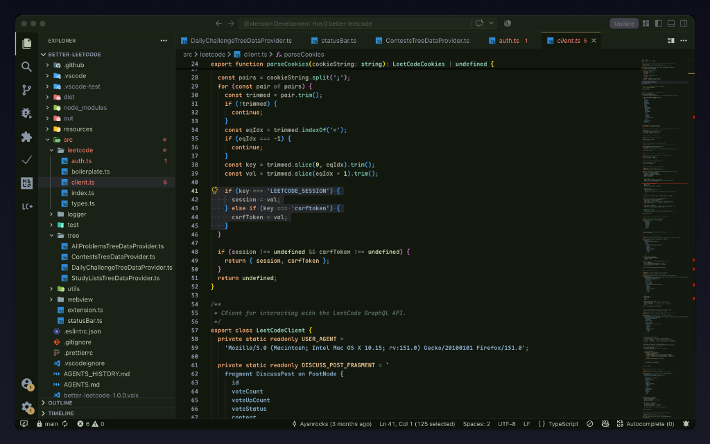
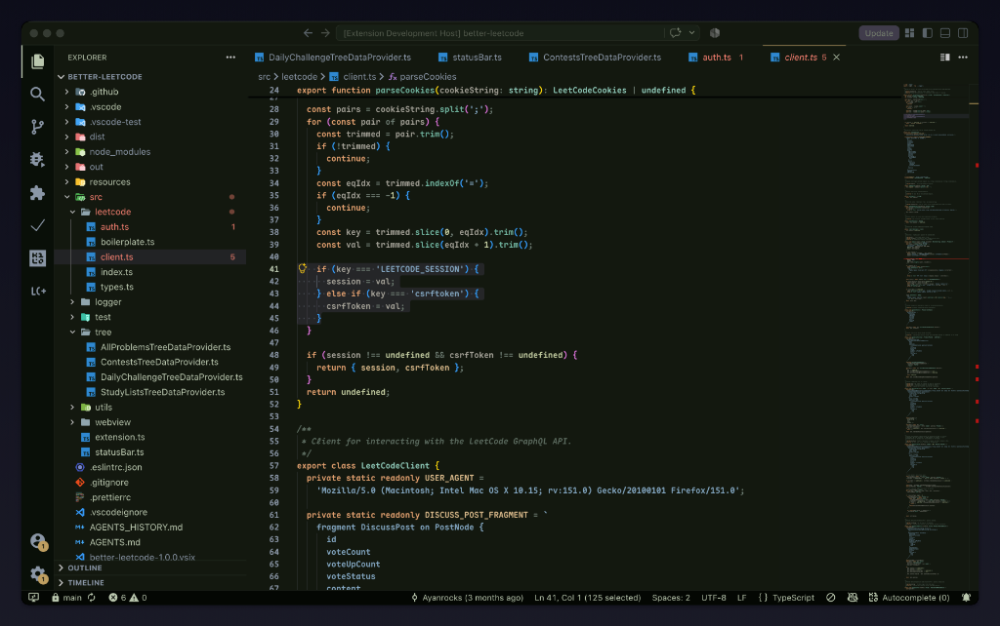
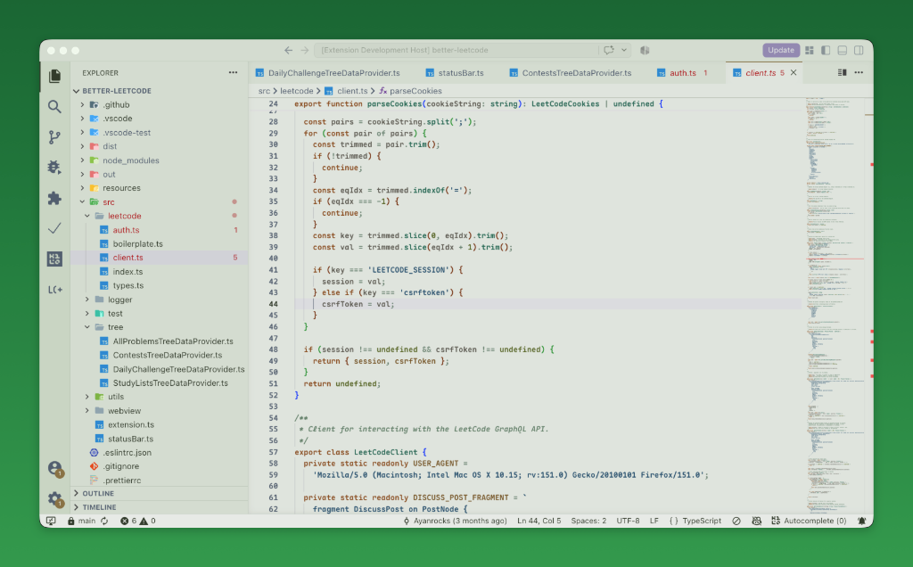
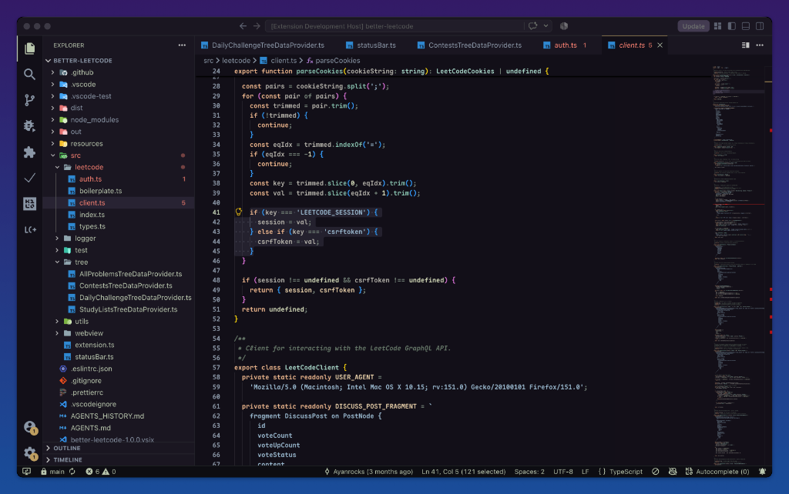
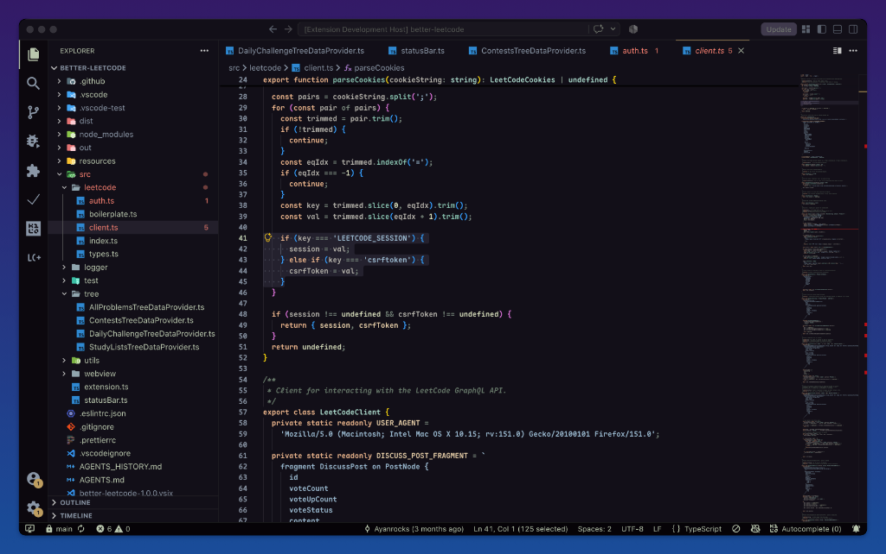

# DuskGrove

<p align="center">
  
</p>

<p align="center">
  <strong>A modular, elegant dark & light VS Code color theme family inspired by twilight forest canopies.</strong>
</p>

<p align="center">
  <a href="https://marketplace.visualstudio.com/items?itemName=Ayanrocks.duskgrove"></a>
  <a href="https://marketplace.visualstudio.com/items?itemName=Ayanrocks.duskgrove"></a>
  <a href="https://marketplace.visualstudio.com/items?itemName=Ayanrocks.duskgrove"></a>
  <a href="https://github.com/Ayanrocks/duskgrove/actions"></a>
  <a href="LICENSE"></a>
  <a href="#accessibility--wcag-compliance"></a>
</p>

---

## Overview

**DuskGrove** is an atmospheric, deeply legible VS Code theme family inspired by twilight falling over evergreen woodland canopies. Designed with low eye fatigue and high semantic distinction in mind, it combines rich forest shadows with soft botanical and twilight tones.

DuskGrove ships **7 curated theme variants** spanning dark, seamless, and daylight workspaces:

1. 🌲 **DuskGrove - Forest** — The flagship twilight canopy with distinct editor and sidebar surfaces.
2. 🍃 **DuskGrove - Forest (Seamless)** — Continuous deep forest canvas for borderless focus.
3. 🌊 **DuskGrove - Ocean** — Midnight abyssal blue depths with woodland syntax clarity.
4. 🐋 **DuskGrove - Ocean (Seamless)** — Seamless ocean floor canvas.
5. 🪻 **DuskGrove - Lavender** — Deep heather violet nightfall with calibrated brightened syntax.
6. 🔮 **DuskGrove - Lavender (Seamless)** — Seamless heather dusk canvas with unified paneling.
7. ☀️ **DuskGrove - Forest Light** — A soothing daytime woodland palette with high contrast and zero glare.

---

## Visual Showcase

### DuskGrove - Forest (Flagship)

_Deep mossy forest shadows (`#121810`), pine bark sidebar (`#1A2116`), warm amber active highlights (`#BE9E5F`), and sage canopy text._

<p align="center">
  
</p>

### DuskGrove - Forest (Seamless)

_Seamless canvas unifying the editor and sidebar for a distraction-free, borderless aesthetic._

<p align="center">
  
</p>

### DuskGrove - Forest Light (Day Mode)

_Calibrated daylight palette with soft mint and lichen undertones (`#DFE4DD`), pine tree greens, and warm earth accents._

<p align="center">
  
</p>

### DuskGrove - Lavender & Lavender (Seamless)

_Twilight violet shadows (`#131018`) paired with brightened heather syntax._

<p align="center">
  
</p>

<p align="center">
  
</p>

---

## Theme Collection

| Variant                             | Mode  | Editor Canvas | Sidebar Surface | Description                                                       |
| :---------------------------------- | :---: | :-----------: | :-------------: | :---------------------------------------------------------------- |
| **DuskGrove - Forest**              | Dark  |   `#121810`   |    `#1A2116`    | Flagship twilight forest canopy with distinct sidebar separation. |
| **DuskGrove - Forest (Seamless)**   | Dark  |   `#121810`   |    `#121810`    | Borderless deep forest canvas connecting explorer and editor.     |
| **DuskGrove - Ocean**               | Dark  |   `#101318`   |    `#161B21`    | Abyssal ocean blue undertone at 215° hue with forest syntax.      |
| **DuskGrove - Ocean (Seamless)**    | Dark  |   `#101318`   |    `#101318`    | Borderless midnight marine canvas.                                |
| **DuskGrove - Lavender**            | Dark  |   `#131018`   |    `#1A1622`    | Deep violet heather shadows with brightened syntax accents.       |
| **DuskGrove - Lavender (Seamless)** | Dark  |   `#131018`   |    `#131018`    | Borderless twilight heather canvas.                               |
| **DuskGrove - Forest Light**        | Light |   `#DFE4DD`   |    `#D4DCD0`    | Low-fatigue daylight woodland palette with WCAG AA compliance.    |

---

## Palette & Design Philosophy

DuskGrove uses a **two-family syntax strategy** that avoids random rainbow coloring:

- **Warm Orange Family** (`#E2A06E` keywords, `#C97D46` tags, `#D9B98A` attributes) for declarative and structural constructs.
- **Sage / Teal / Steel Family** (`#72B5A0` functions, `#8FC9B8` types/classes, `#82A6C0` strings, `#C2CBA0` numbers) for referential and value-bearing tokens.
- **Warm Neutral Slate** (`#A2A096`) for variables, ensuring high identifier density reads naturally without overwhelming green saturation.
- **Warm Amber Gold Accent** (`#BE9E5F`) for workbench focus indicators, cursor, active tab borders, and split panel sashes.

### Flagship Forest Palette Tokens

| Token Role              |       Hex Code        | Purpose                                                    |
| :---------------------- | :-------------------: | :--------------------------------------------------------- |
| **Editor Canvas**       |       `#121810`       | Deep forest night canvas (low fatigue background)          |
| **Sidebar Surface**     |       `#1A2116`       | Pine bark Explorer and Activity Bar surface                |
| **Primary Text**        |       `#B9C6AE`       | Lichen canopy primary foreground                           |
| **Muted Text**          |       `#8A95A5`       | Cool mist slate for secondary metadata and icons           |
| **Accent Highlight**    |       `#BE9E5F`       | Warm amber gold for cursor, active tabs, and resize sashes |
| **Keywords**            |       `#E2A06E`       | Warm peach/orange for declaration and structural keywords  |
| **Strings**             |       `#82A6C0`       | Steel-blue / azure with clear 44° hue separation from teal |
| **Numbers & Constants** |       `#C2CBA0`       | Muted olive-honey for numeric literals                     |
| **Functions**           |       `#72B5A0`       | Mountain stream teal for methods and call expressions      |
| **Types & Classes**     |       `#8FC9B8`       | Glacial sage for interfaces, types, and class declarations |
| **Variables**           |       `#A2A096`       | Low-saturation warm gray for calm identifier scanning      |
| **Comments**            |       `#5B6A5E`       | Italicized forest understory for non-intrusive annotations |
| **Tags**                |       `#C97D46`       | Terracotta for JSX, HTML, and XML tags                     |
| **Attributes**          |       `#D9B98A`       | Golden ochre for JSX/HTML attributes and object properties |
| **Error / Warning**     | `#D9707A` / `#E0B168` | Distinct botanical error berry red and autumn warning gold |

---

## Optional: Italic Keywords, Types & Attributes

By default, DuskGrove strictly reserves `fontStyle: "italic"` for comments to maximize visual calm and avoid reading fatigue across primary code constructs. Rather than duplicating theme variants for cosmetic font styles, VS Code provides a native customization mechanism via `editor.tokenColorCustomizations`.

This is an optional, recommended addition to your personal `settings.json` if you prefer cursive/italic styling for declaration keywords, type definitions, and attributes.

### Recommended `settings.json` Snippet

Add the following to your user `settings.json` (`Cmd/Ctrl + Shift + P` -> `Preferences: Open User Settings (JSON)`):

```json
"editor.tokenColorCustomizations": {
  "textMateRules": [
    {
      "scope": [
        "storage",
        "storage.type",
        "storage.modifier",
        "keyword.other.import",
        "keyword.other.package"
      ],
      "settings": { "fontStyle": "italic" }
    },
    {
      "scope": [
        "entity.name.type",
        "entity.name.type.class",
        "support.type"
      ],
      "settings": { "fontStyle": "italic" }
    },
    {
      "scope": "entity.other.attribute-name",
      "settings": { "fontStyle": "italic" }
    }
  ]
}
```

### Font Rendering & Cursive Comments

VS Code's TextMate rules only support `fontStyle: "italic" | "bold" | "underline" | "strikethrough"`. Applying `italic` in VS Code renders whatever italic glyph design is built into your active editor font.

- **Victor Mono** (free, open source) features dedicated cursive script letterforms designed specifically for code comments and keywords.
- **JetBrains Mono** and **Cascadia Code** feature clean synthetic italic slants that pair seamlessly with DuskGrove.

#### Recommended Font Configuration (Victor Mono)

```json
"editor.fontFamily": "Victor Mono, JetBrains Mono, monospace",
"editor.fontLigatures": true,
"editor.fontWeight": "500"
```

---

## Architecture & Scalability

DuskGrove is structured so that **color values exist in exactly one place**: `src/tokens/`.

The build compiler (`src/build/`) transforms semantic tokens into:

1. **Workbench UI colors** (`colors` in `themes/*.json`) via `uiMapping.ts`.
2. **TextMate syntax scopes** (`tokenColors` in `themes/*.json`) via `syntaxMapping.ts`.
3. **LSP semantic highlights** (`semanticTokenColors` in `themes/*.json`) via `semanticTokenMapping.ts`.

```
src/
├── tokens/                     # SOURCE OF TRUTH (one file per variant)
│   ├── types.ts                # Strict ColorTokenSet TypeScript interface
│   ├── DuskGrove-dark.ts       # Flagship Forest palette
│   ├── DuskGrove-forest-light.ts# Forest Light palette
│   ├── DuskGrove-ocean.ts      # Ocean palette
│   ├── lavender.ts             # Lavender palette
│   └── index.ts                # Central variant registry array
├── build/                      # PURE COMPILER & MAPPING RULES
│   ├── colorUtils.ts           # HSL lighten/darken & alpha calculation
│   ├── uiMapping.ts            # Maps tokens to VS Code workbench colors
│   ├── syntaxMapping.ts        # Maps tokens to TextMate scopes
│   ├── semanticTokenMapping.ts # Maps tokens to LSP semantic tokens
│   ├── buildTheme.ts           # Assembles the full theme JSON
│   └── generate.ts             # CLI builder: compiles themes & updates package.json
└── validate/                   # QUALITY GATES
    ├── schema.ts               # Zod validation matching VS Code theme schema
    └── contrast.ts             # WCAG 2.1 relative luminance & contrast checks
```

---

## Local Development

```bash
# 1. Install dependencies
npm install

# 2. Compile all theme variants deterministically
npm run build:themes

# 3. Run automated tests (compiler, schema, contrast)
npm test

# 4. Typecheck and lint
npm run typecheck
npm run lint
npm run format:check

# 5. Package extension (.vsix)
npm run package
```

---

## Accessibility & WCAG Compliance

DuskGrove is engineered from the ground up for high readability and low eye strain:

- **WCAG 2.1 AA Compliant**: All body text maintains $\ge 4.5:1$ contrast against the editor background.
- **De-emphasized Roles**: Comments and UI chrome maintain $\ge 3.0:1$ non-text contrast.
- **Automated Contrast Testing**: Contrast ratios are continuously verified by mathematical tests in `test/contrast.test.ts`.

---

## Security & Trust Properties

1. **Zero Runtime Code:** DuskGrove ships only static JSON theme definitions. No extension host JavaScript/TypeScript is executed at runtime.
2. **Minimal Surface Area:** All dependencies are `devDependencies` only and completely excluded from packaging via `.vscodeignore`.
3. **Reproducible Builds:** Themes are deterministically compiled from token definitions.

---

## Documentation & Contributing

- 📖 **[Contributing Guide](CONTRIBUTING.md)**: Guidelines for contributing code, reporting issues, and authoring new variants.
- 📋 **[Production Release Checklist](docs/PRODUCTION_CHECKLIST.md)**: Pre-flight checklist for releases and marketplace publication.
- 📝 **[Changelog](CHANGELOG.md)**: History of releases and notable updates following Keep a Changelog.
- 🤝 **[Code of Conduct](CODE_OF_CONDUCT.md)**: Community standards and expectations.

---

## License

[MIT](LICENSE) © DuskGrove Contributors
